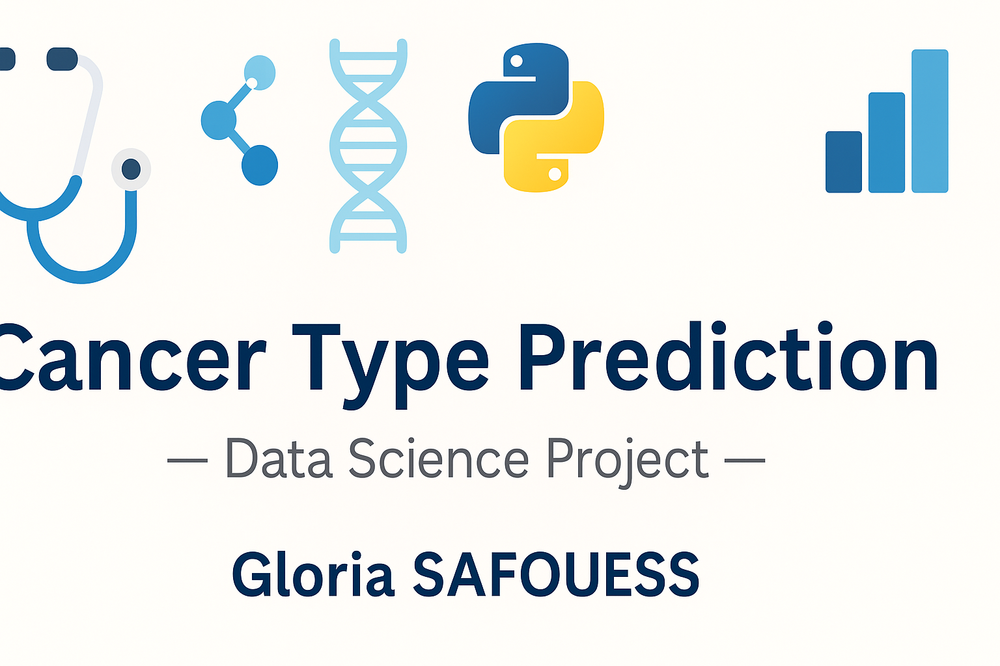
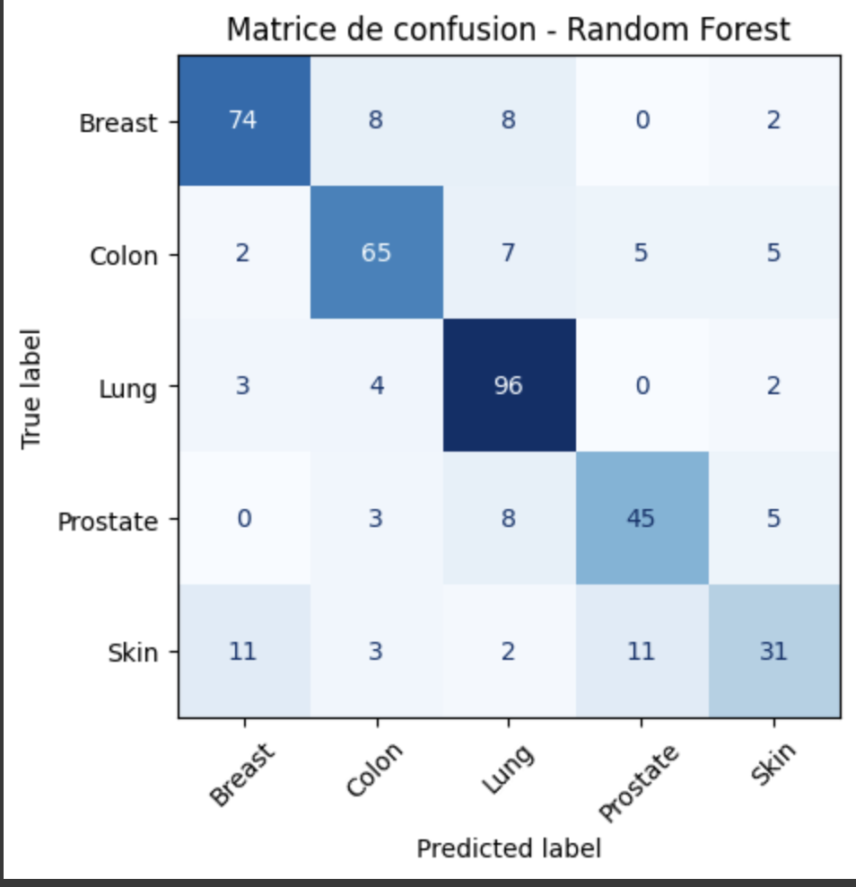
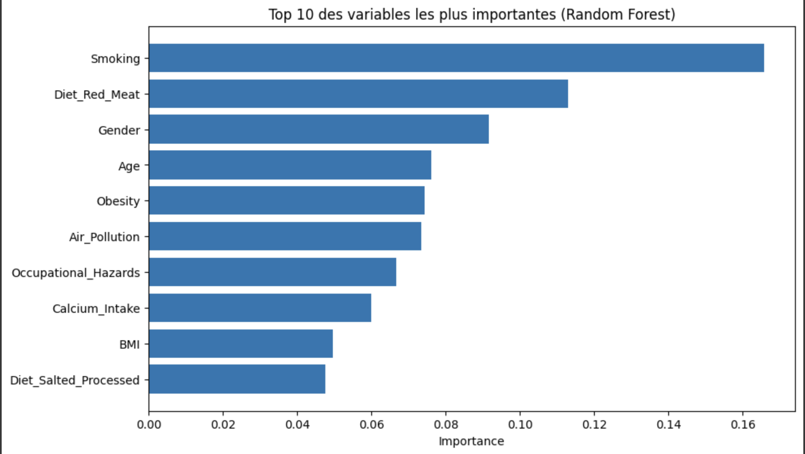
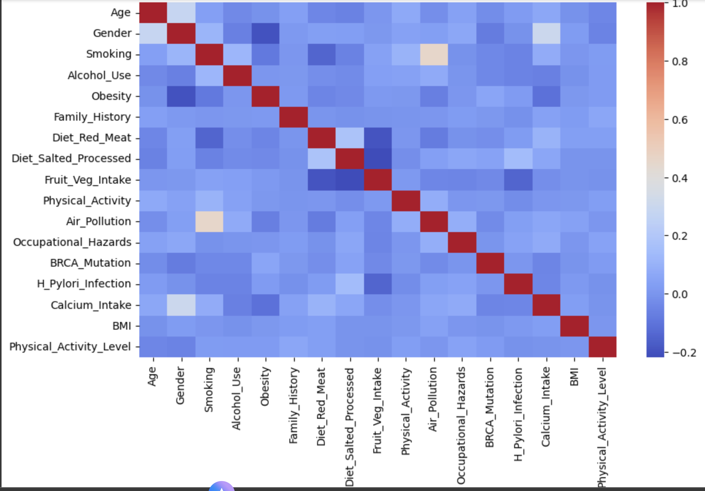

  

<h1 align="center">🩺 Cancer Type Prediction — Data Science Project</h1>

  <strong>Machine Learning project to predict cancer types based on patient risk factors.</strong> 
  Built with <code>Python</code> • <code>scikit-learn</code> • <code>pandas</code> • <code>matplotlib</code>

---

### 🧠 Description
This project uses **machine learning** to predict the type of cancer (lung, breast, colon, prostate, skin)  
based on various risk factors such as age, smoking habits, obesity, and genetic markers.

---

### 🧩 Key Features
- Exploratory Data Analysis (EDA)
- Correlation analysis and feature importance
- Random Forest Classifier (200 trees)
- Model evaluation with Confusion Matrix
- Clear medical interpretation of features

---

### 📊 Visualizations
| Confusion Matrix | Feature Importances | Correlation Heatmap |
|------------------|--------------------|----------------------|
|  |  |  |

---

### 🚀 Technologies

---

### 📚 Files in this repository
| File | Description |
|------|--------------|
| `TP_Prédiction_Type_de_cancer.ipynb` | Full notebook (EDA, model, evaluation) |
| `cancer-risk-factors.csv` | Dataset used |
| `Rapport_Type_de_cancer.pdf` | Final report |
| `TP_DataScience_MED.pdf` | Original assignment document |

---

### 👩‍💻 Author
**Gloria SAFOUESS**  
🎓 Data Science Student — October 2025  

🎓 Data Science Student — October 2025  
🔗 [LinkedIn](https://linkedin.com) • [GitHub](https://github.com/1Glori)
